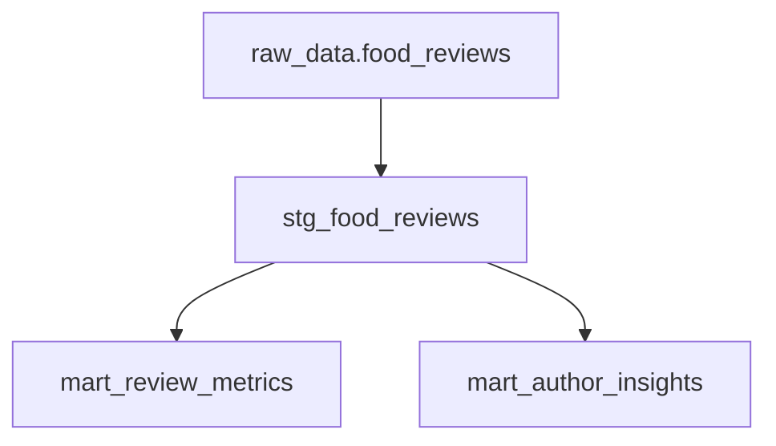

# Food Reviews Analytics - dbt Project

A comprehensive dbt project for analyzing food recipe reviews using the **Medallion Architecture** (Bronze/Silver/Gold) on BigQuery with professional development tools and best practices.

## 🏗️ Project Architecture

This project implements a layered data architecture with clear separation of concerns:

```
📦 dbt_bigquery/
├── 🥉 dbt_core/models/raw/      # Bronze Layer - Raw data sources
├── 🥈 dbt_core/models/staging/  # Silver Layer - Cleaned & standardized
├── 🥇 dbt_core/models/marts/    # Gold Layer - Analytics-ready business logic
└── 📚 Documentation            # Comprehensive docs and examples
```

### 🔄 Data Lineage



## 🚀 Quick Start

### Prerequisites
- [Python 3.8+](https://www.python.org/downloads/)
- [Git](https://git-scm.com/)
- [Google Cloud Project](https://cloud.google.com/) with BigQuery enabled
- Service account with BigQuery permissions

### 🛠️ Setup Desenvolvimento (Recomendado)

```bash
# 1. Clone o repositório
git clone <repository-url>
cd dbt_bigquery

# 2. Execute o script de setup automático
./setup-dev.sh

# 3. Ou configure manualmente:
python3 -m venv .venv
source .venv/bin/activate
pip install -r requirements-dev.txt
```

### 🎯 Setup Básico

```bash
# Instalar apenas dependências essenciais
pip install dbt-bigquery

# Configurar profiles.yml com suas credenciais
# Testar conexão
cd dbt_core
dbt debug
```

## 📊 Data Models

### 🥉 Raw Layer (Bronze)
- **Sources**: `raw_data.food_reviews` - Raw recipe review data from BigQuery

### 🥈 Staging Layer (Silver)
- **`stg_food_reviews`**: Cleaned and standardized review data
  - Standardized column names (snake_case)
  - Data type conversions and validations
  - Quality flags and calculated fields
  - Filters out invalid records

### 🥇 Marts Layer (Gold)
- **`mart_review_metrics`**: Recipe-level aggregated metrics
  - Volume metrics (total reviews, unique reviewers)
  - Rating analysis (averages, distributions)
  - Quality categorization (Excellent, Very Good, Good, Fair, Poor)
  - Popularity classification (High, Medium, Low, Very Low)

- **`mart_author_insights`**: Author behavioral analysis
  - Activity patterns (Super Active, Very Active, Active, Moderate, Casual)
  - Rating tendencies (Optimistic, Critical, Consistent, Varied)
  - Review statistics and temporal analysis

## 🔧 Development Commands

### Using dbt directly

```bash
cd dbt_core

# Test connection
dbt debug

# Run pipeline
dbt run
dbt test

# Generate documentation
dbt docs generate
dbt docs serve
```

## 🧪 Data Quality & Testing

The project includes comprehensive data quality tests:

- **Source Tests**: Uniqueness and not-null constraints on raw data
- **Staging Tests**: Data validation and business rules
- **Marts Tests**: Business logic validation and referential integrity
- **Custom Tests**: `valid_rating` macro for integer range validation

## 📋 Project Structure

```
dbt_bigquery/
├── 📁 dbt_core/                    # Main dbt project
│   ├── models/
│   │   ├── raw/sources.yml         # Source definitions
│   │   ├── staging/                # Silver layer models
│   │   └── marts/                  # Gold layer models
│   ├── macros/                     # Custom macros
│   ├── tests/                      # Custom tests
│   └── dbt_project.yml            # dbt configuration
├── 🔧 .gitignore                   # Git ignore patterns
├── 📋 requirements-dev.txt         # Development dependencies
└── 📚 README.md                   # This file
```

## 🔒 Security & Best Practices

### Credentials Management
- Service account keys excluded from Git
- Environment variables for sensitive data
- Separate profiles for different environments

### Code Standards
- SQL formatting with SQLFluff
- Consistent naming conventions
- Comprehensive documentation requirements
- Automated testing on commit

## 🚦 CI/CD Pipeline

```bash
# Local development workflow
git add .
git commit -m "feature: add new model"

```

## 📖 Column Descriptions

### Key Metrics in `mart_review_metrics`:
- `avg_rating`: Average rating for the recipe
- `total_reviews`: Total number of reviews
- `popularity_category`: Recipe popularity classification
- `quality_category`: Recipe quality classification
- `text_completion_rate`: Percentage of reviews with text

### Key Insights in `mart_author_insights`:
- `total_reviews_written`: Author's review activity level
- `avg_rating_given`: Author's rating tendency
- `activity_level`: Author activity classification
- `rating_behavior`: Author's rating pattern
- `positive_review_rate`: Percentage of 4-5 star reviews given

## 🛠️ Development

### Adding New Models
1. Create model in appropriate layer directory
2. Add schema documentation in `schema.yml`
3. Include data tests
4. Update this README

### Best Practices
- Use descriptive model names with layer prefixes (`stg_`, `mart_`)
- Include comprehensive documentation
- Add data quality tests
- Follow naming conventions (snake_case)
- Use `{{ ref() }}` for model dependencies to maintain lineage

## 🔍 Troubleshooting

### Common Issues

**dbt connection issues:**
```bash
cd dbt_core
dbt debug
# Check credentials and profiles.yml
```


## 📚 Resources

- [dbt Documentation](https://docs.getdbt.com/)
- [BigQuery Documentation](https://cloud.google.com/bigquery/docs)
- [Medallion Architecture](https://www.databricks.com/glossary/medallion-architecture)
- [dbt Best Practices](https://docs.getdbt.com/guides/best-practices)
- [SQLFluff Documentation](https://docs.sqlfluff.com/)
